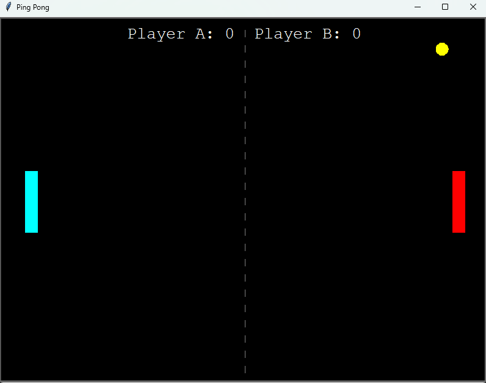
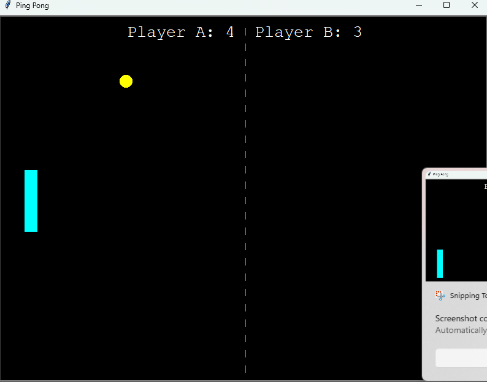
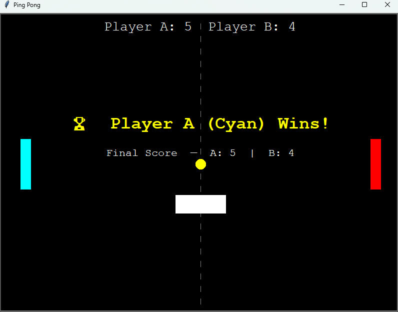

# Pingpong
A two-player Ping Pong game built with Python turtle featuring real-time controls, scoring, pause/resume, and restart functionality. 

## Output

## Methodology

Uses an event-driven game loop with continuous screen updates, keyboard input tracking, collision detection for ball–paddle and wall interactions, velocity-based ball movement, and state management for pause and win conditions.

